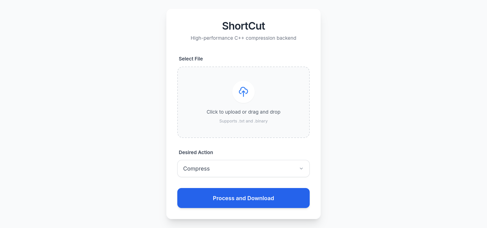

# 📉 ShortCut | Huffman File Compressor

ShortCut is a high-performance file compression and decompression tool featuring a C++ engine for bit-level data processing and a modern Flask web interface. This project demonstrates efficient systems programming, data structure implementation, and cross-platform integration.
## 🚀 Overview

ShortCut uses the Huffman Coding algorithm to reduce file sizes by assigning variable-length binary codes to characters based on their frequency.
### Key Features

    Hybrid Architecture: Low-level C++ backend for computational speed with a Python/Flask frontend.

    OS-Aware Auto-Compiler: Automatically detects your OS and compiles the C++ source code on the first run.

    Modern UI: A responsive, card-based interface built with Tailwind CSS.

    One-Click Setup: A comprehensive bash script handles environment isolation and dependency installation.

## 📸 Usage
### Web Interface


    Launch: Run ./run.sh and open http://127.0.0.1:5000 in your browser.

    Upload: Drag and drop or click to select a .txt or .binary file.

    Process: Select your action and click Process and Download.

    The modern web interface allows for seamless file processing without terminal knowledge.

### CLI Backend (Advanced)


For engineering analysis, the backend can be run directly to view performance metrics:
```Bash

### Usage: ./source.out [filename_without_extension] [e/d]
./source.out test e
```
Example Output:
```Plaintext
encoding efficiency = 0.993769
compression ratio = 8192 / 19240 = 0.42578 
DONE!!
```
## 🛠️ Installation & Setup
### Prerequisites

    C++ Compiler: g++ (Fedora: sudo dnf groupinstall "Development Tools").

    Python: Version 3.10 or higher.

### Quick Start
```Bash

git clone https://github.com/nikolozue93/ShortCut.git
cd ShortCut
chmod +x run.sh
./run.sh
```
## 🧠 Technical Highlights

    Priority Queue Construction: Uses a Min-Heap to build the Huffman Tree in O(nlogn) time.

    Bit-Level Serialization: Manually packs bits into bytes to ensure maximum compression efficiency.

    Telemetry: Calculates theoretical entropy vs. actual encoding length to provide efficiency ratings.

## 📂 Project Structure

    app.py: Flask server and dynamic C++ build manager.

    source.cpp: C++ entry point and CLI handler.

    huffman.h / .cpp: Core logic for tree traversal and bit-mapping.

    templates/: Responsive HTML/Tailwind CSS files.

    archive/: Legacy CLI versions from the initial 2023-24 development phase.

## 👥 Credits

Originally developed as a university project in 2023-2024.
### Core Team (Initial Development)

    Nikoloz Beridze: Lead C++ Engineering & Bit-level Logic.

    Beka Kopadze: Python Backend Integration.

    Nikoloz Tolordava: Original Web Interface & Design.

Special Thanks

    Nikoloz Naskidashvili: Special thanks for significant assistance and guidance on the core backend implementation.

2026 Modernization

    Nikoloz Beridze: Refactored for cross-platform compatibility, implemented the auto-compilation engine, and redesigned the UI using Tailwind CSS.

## 🛡️ License

Distributed under the MIT License.
